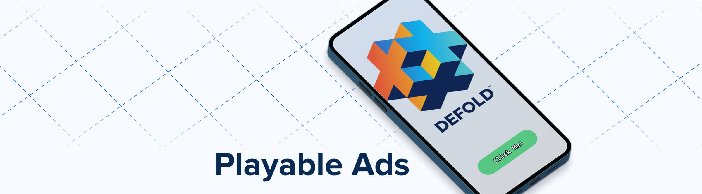

[](https://github.com/indiesoftby/defold-playable-ads/)

# Defold for Playable Ads

Develop and build playable ads with the Defold game engine!

This repository contains an easy-to-use script for the [Gulp](https://gulpjs.com/) build system, which:
1. Downloads [bob.jar](https://d.defold.com/stable/).
2. Builds the project for the HTML5 platform using `bob.jar`.
3. Combines all resources into **a single HTML file**. The binary of the Defold engine is compressed using Zstd and encoded with Base64.

☝ All you need is to be a little familiar with the command line. The script will do the rest on its own.

**Open the build result - [`https://indiesoftby.github.io/defold-playable-ads/index.html`](https://indiesoftby.github.io/defold-playable-ads/index.html)**. Also, you can put the link to it in the [Ad Tester tool](https://play.google.com/store/apps/details?id=com.unity3d.auicreativetestapp&hl=en&gl=US) to check that it's a valid playable ad.

Please note that the example build doesn't use any external resources as required. The total size is less than 1 megabyte! In this example, BasisU Decoder, Physics, Live Update are disabled in the engine.

## Current Status

Feel free to ask questions: [the topic about this asset is on the Defold forum](https://forum.defold.com/t/defold-for-playable-ads/68689).

| Tool Version   | Defold Version | Status        |
| -------------- | -------------- | ------------- |
| 1.4.0          | 1.6.3          | Tested ✅     |

### Supported Platforms

| Platform | Status |
| ---------| -------|
| [Facebook](https://developers.facebook.com/tools/playable-preview/) | Supported ✅ |
| [Unity Ads](https://docs.unity.com/acquire/en-us/manual/playable-ads-specifications) | Supported ✅ |
| AppLovin, Snapchat, etc | Not tested. Can be done on request ⏩ |

## About A Playable Ad

A [playable ad](https://learn.g2crowd.com/playable-ads) is an interactive advertisement, mostly used to promote mobile games. A playable ad acts as a demo of the game (or product), allowing users to quickly play the game directly in the ad before downloading it.

Accepted sizes for HTML5 playable ad vary between ad networks:
1. [Facebook specifications for Playable Ads](https://www.facebook.com/business/help/412951382532338?helpref=faq_content) require that there be a single file for playable ad that contains all assets as part of that single HTML file and assets should be data uri compressed. Also playable asset size should be less than 2MB. And Facebook has started accepting .zip archives with up to 5MB since 2020.
2. [Google](https://support.google.com/google-ads/answer/9981650?hl=en) requires a .ZIP file with a maximum size of 5MB and no more than 512 files within the .ZIP. Plus .ZIP files can contain the following formats: HTML, CSS, JS, GIF, PNG, JPG, JPEG, SVG.
3. [AppLovin](https://p.applov.in/playablePreview?create=1&qr=1), and [Unity Ads](https://docs.unity.com/acquire/en-us/manual/playable-ads-specifications) require a single HTML file. The maximum ad size is 5MB.

## Playable Ad Development Steps With Defold

1. Create a new project, develop some simple game mechanics for your ad. Or use a part of your project that you will advertise.
2. Optimise your project according to the steps in the `How To Shrink Your Game Size` section below.
3. Follow the simple steps in the `Usage` section and add the following code to your game to handle the call to action:

```lua
local function call_to_action()
    if html5 then
        html5.run([[
            try {
                // <!> The function is located in the `playable_ad/manifests/web/engine_template.html` file.
                // <!> The function exists only when you build your project using `gulp`.
                doClick();
            } catch (e) {
                console.warn(e);
            }
        ]])
    end
end
```

> [!NOTE]
> If your ad is for Unity Ads, change the links to App Store and Google Play in the `playable_ad/manifests/web/engine_template.html` file at the very bottom in the `doClick()` function. This should be done directly in this file, as a playable ad testing tools of the ad platforms usually require these links to be directly in the html file.

> [!TIP]
> 99% of playable ad build time with the script presented here takes a build on the remote Defold extender server. And usually it is about 1-2 minutes! So we advise you to develop your ad as a normal game and be pleased with super fast desktop builds. And only when you are ready to upload the playable ad to the ad system, then run the playable ad build script.

## How To Shrink Your Game Size

Follow these tips to decrease the resulting size of the HTML file significantly:

1. Customize `.appmanifest` to keep only the necessary parts of the engine.
2. Keep only the core mechanic of your game and all assets that it requires. Remove everything else!
3. Install the latest version of the [Zstd executable](https://github.com/facebook/zstd/releases) (i.e. Zstd 1.5.0 has better compression than Zstd 1.4.x).

> [!IMPORTANT]
> And, the last tip and the most important: set [HTML5 heap size](https://defold.com/manuals/project-settings/#heap-size) as small as possible (**minimum is 32MB**, default is 256MB) to allow your game to run on low-end Android devices.

## Required Prerequisites

You will need the following apps installed on your environment:
- Node.js 12 or newer.
- Java 17 (Defold >=1.4.8).
- Zstd 1.4 or newer.
- Gulp CLI.

<details>
  <summary>Windows</summary>

1. Download and install [Java 17](https://adoptium.net/).
2. Download and unpack [Zstd for Windows 64-bit](https://github.com/facebook/zstd/releases/download/v1.5.5/zstd-v1.5.5-win64.zip). Add the path to the `zstd.exe` executable to the PATH environment variable. Also, you can just put `zstd.exe` in the `playable_ad` folder - the script will use it from here.
3. Download [Node.js Windows Installer (.msi) for 64-bit](https://nodejs.org/en/download/) and install it.
4. Open `cmd.exe` and run to install Gulp CLI:

```
npm install --global gulp-cli
```

> [!NOTE]
> We recommend using Windows Terminal to see the coloured log. If you use PowerShell to run your scripts, run `gulp --no-color` to avoid the problem when the text colour matches the background colour.

</details>

<details>
  <summary>Ubuntu/Debian or Windows Subsystem for Linux (WSL)</summary>

```
sudo apt install --no-install-recommends openjdk-17-jre-headless nodejs npm zstd

npm install --global gulp-cli
```

</details>

<details>
  <summary>macOS</summary>

Install [brew](https://brew.sh/) and paste that in a macOS Terminal prompt:

```
brew install node@18
brew install openjdk@17
brew install zstd@1.5.5

npm install --global gulp-cli
```
</details>


## Usage

Copy the `playable_ad` folder into the root of your project and the `.defignore` file. Then, in the command line:

```
cd your_project_folder
cd playable_ad
npm install
gulp
```

`npm install` installs required NodeJS packages (run it only once!). 

`gulp` builds the project into a single HTML file.

The resulting HTML file is located at `/playable_ad/build/output_js-web/YOUR_PROJECT_TITLE/YOUR_PROJECT_TITLE.html`.

### Command Line Arguments

You can pass the following arguments from the command line to the script:

```bash
--architectures <arg>           Comma separated list of architectures to include: js-web,wasm-web (default = wasm-web).
--embed-archive-js <arg>        Embed `_archive.js` file: true/false (default = true).

# The following arguments passed to Bob.jar as is:
--build-server <arg>            The build server (default = https://build.defold.com).
--settings <arg>                Path to a game project settings file. Only one occurrance is allowed.
--variant <arg>                 Specify debug or release (default = release).
--texture-compression <arg>     Use texture compression as specified in texture profiles (default = true).
```

i.e. run `gulp --embed-archive-js=false` to build a playable ad with the two files:

* `/playable_ad/build/output_js-web/YOUR_PROJECT_TITLE/YOUR_PROJECT_TITLE.html`
* `/playable_ad/build/output_js-web/YOUR_PROJECT_TITLE/YOUR_PROJECT_TITLE_archive.js`

## License

MIT.

The splash uses an image from [iconfinder.com](https://www.iconfinder.com/icons/1222768/facebook_ads_facebook_marketing_marketing_icon).

The included music credits:
```
Silly Intro by Alexander Nakarada | https://creatorchords.com
Music promoted by https://www.chosic.com/free-music/all/free-music/
Attribution 4.0 International (CC BY 4.0)
https://creativecommons.org/licenses/by/4.0/
```
