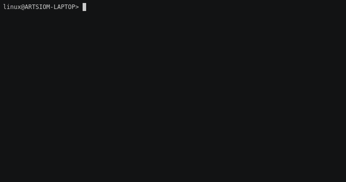

# Defold for Playable Ads

[](https://travis-ci.com/aglitchman/defold-playable-ads)

A [playable ad](https://learn.g2crowd.com/playable-ads) is an interactive advertisement, mostly used to promote mobile games. A playable ad acts as a demo of the game (or product), allowing users to quickly play the game directly in the ad before downloading it.

[Facebook specifications for Playable Ads](https://www.facebook.com/business/help/412951382532338?helpref=faq_content) require that there be a single file for playable ad that contains all assets as part of that single HTML file and assets should be data uri compressed. Also playable asset size should be less than 2MB.

[**Play the demo**](https://aglitchman.github.io/defold-playable-ads/) project online. Please note that it does not use any external resources as required.

This project contains the [Gulp](https://gulpjs.com/) tasks, which:
1. Downloads [bob.jar](https://d.defold.com/stable/).
2. Builds the project for the HTML5 platform using `bob.jar`.
3. Combines all resources into **one large HTML file**. The asm.js binary of the Defold engine is compressed using zlib deflate.

Note: this project was created from the "mobile" project template. For this reason Android and iOS icons are set, iOS launch images (blank ones) are set.

## Required Prerequisites

You will need Node.js, Java and Gulp CLI installed on your environment.

### Ubuntu/Debian or [Windows Subsystem for Linux (WSL)](https://docs.microsoft.com/en-us/windows/wsl/about)

```
sudo apt install -y --no-install-recommends java nodejs npm

npm install --global gulp-cli
```

### macOS

Install [brew](https://brew.sh/) and paste that in a macOS Terminal prompt:

```
brew install node
brew cask install java

npm install --global gulp-cli
```

## Installation

```
git clone https://github.com/aglitchman/defold-playable-ads.git
cd defold-playable-ads
npm install
```

## Usage

Run the `gulp` command to start the build process:



The resulting HTML file is located at `/build/playable_ad/js-web/YOUR_PROJECT_TITLE/YOUR_PROJECT_TITLE.html`.

### In Your Project

1. Copy these files to your project root folder:
```
gulpfile.js
html5/engine_template.html
package.json
```
2. Set `html5/engine_template.html` as custom HTML template in your [game project settings](https://www.defold.com/manuals/html5/). Also add path `/node_modules` to your `.gitignore`.
3. Run `npm install`, then `gulp`.
